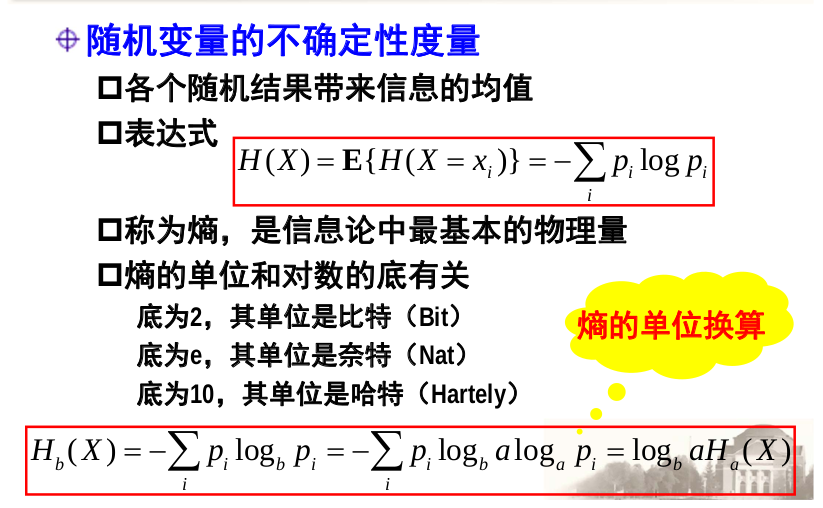
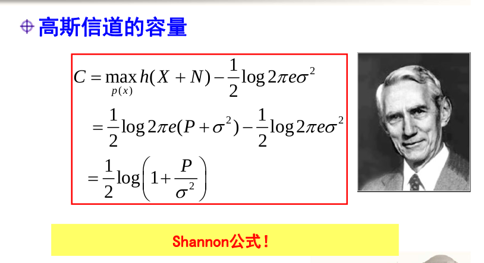
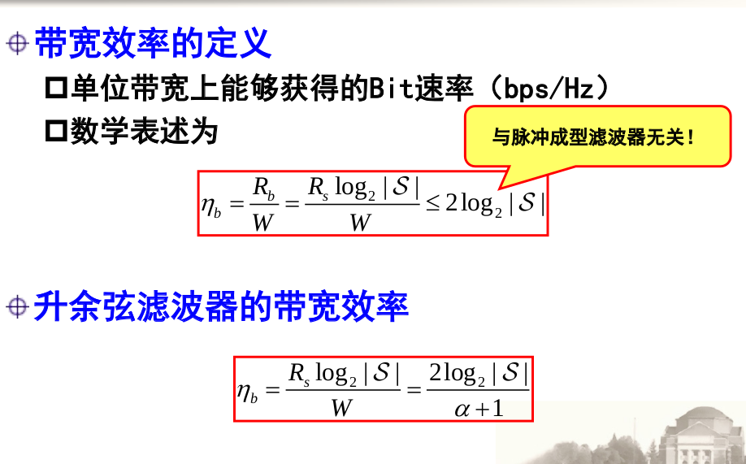
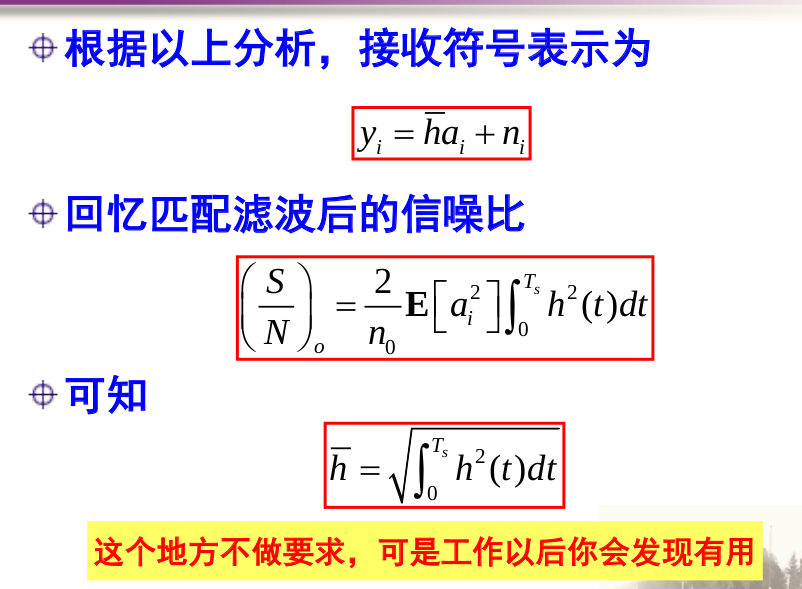

## 通信与网络
## 王道烩 
## 2018.9.8

网络的分层架构

- 应用层
- 表示层
- 会话层
- 传输层
- 网络层
- 链路层
- 物理层

### 课程主要内容

- 信息论基础
- 信源与信道编码
- 数字调制与解调
- 多址与复接
- 路由与交换
- 流控与队列管理

### 绪论与信息论基础

通信中的基础问题:

- 通信的资源
- 通信的失真

信息:能够消除不确定性的东西.小概率时间蕴含的信息量大

若两个随机变量相互独立,那么这两个的互信息为零.
若两个随机变量相等,则条件熵为0.

微分熵是对连续型变量相对不确定性的一种描述.

### 压缩编码理论

无损压缩:输入数字序列输出数字序列.
有损压缩:输入模拟信号(连续时间,连续幅值),输出数字序列.

带通抽样定理

均匀量化的问题:对具有不同概率权重的区间一视同仁,没有考虑概率密度对量化噪声的影响.

为了解决,可以对经常出现的区域使用较细的颗粒度进行量化,不经常出现的区域使用较粗的颗粒度进行量化.

增量调制:

但是如果变化过于大,可能会发生过载.这个时候可以通过使用自适应增量的方法.信号变换缓慢的时候,采用小的增量,变化大的时候采用大的增量.

### 数字基带传输

格雷码能够使得相邻符号出错时,二进制比特只查一位.

如果没有线谱,表示均值为零.

### 最佳接受

### 判决与差错

