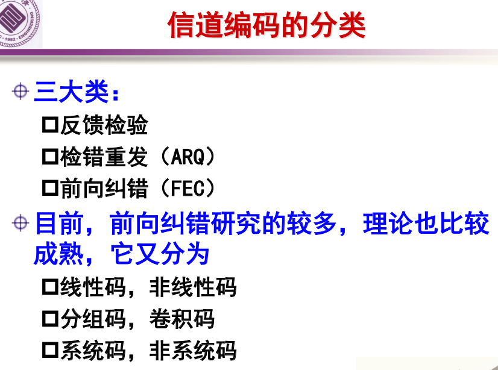
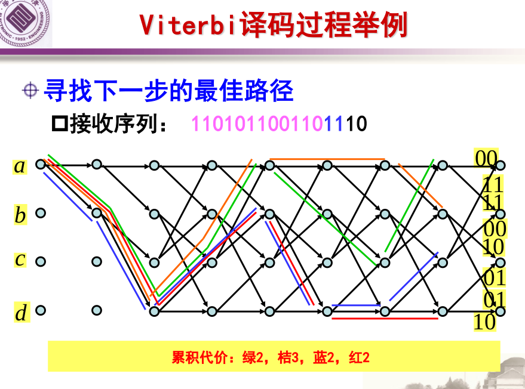
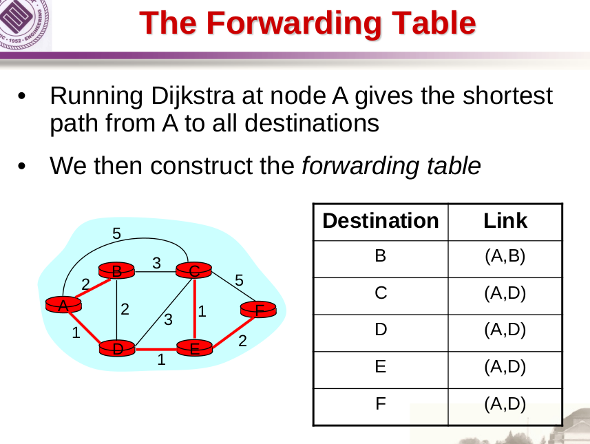
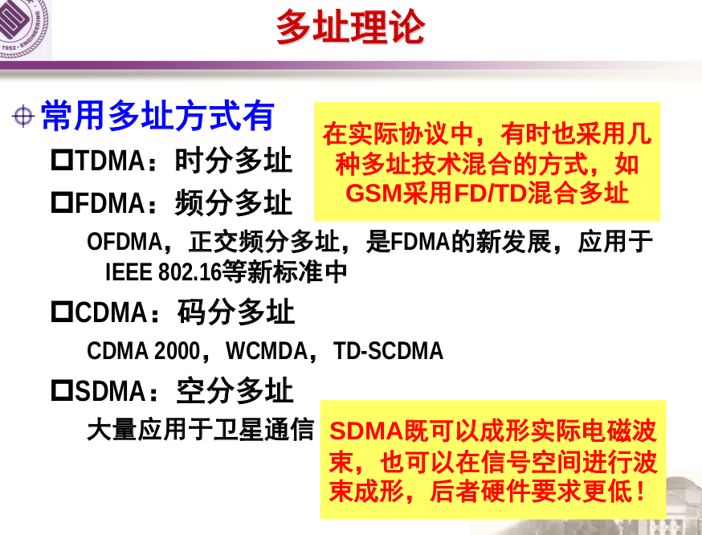
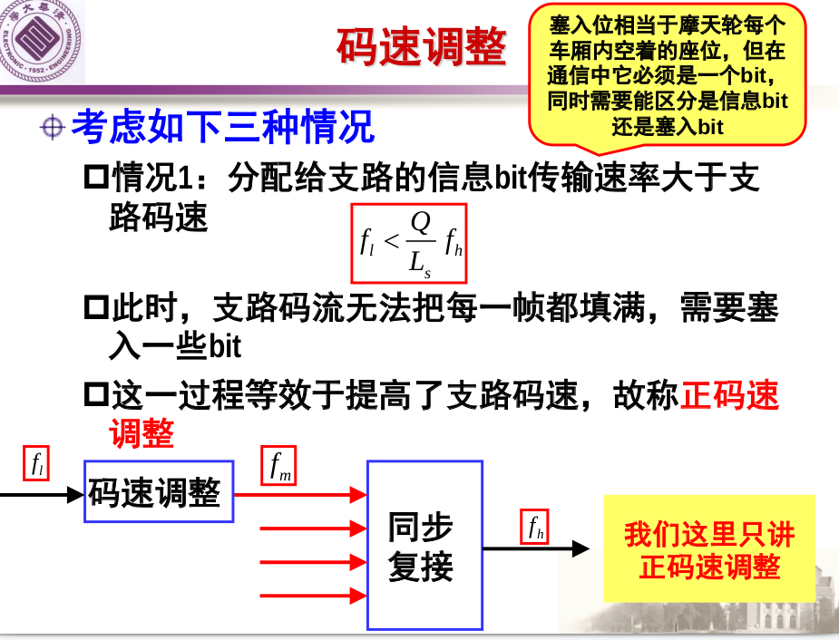
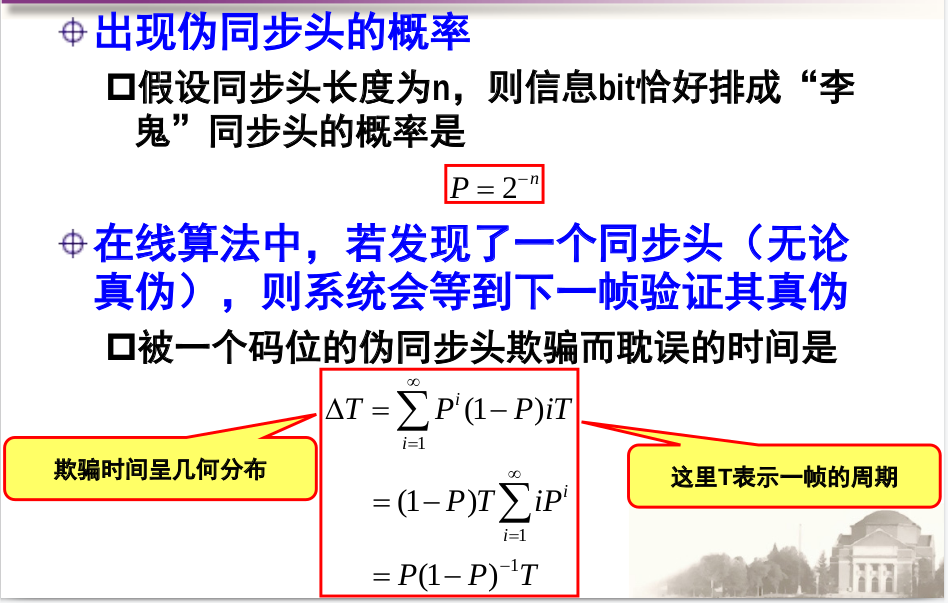

## 通信与网络
## 王道烩
## 2018.9.10

### 差错控制码

### 卷积码

(2,1,3)码的自由距为5

### 交换.路由与流量控制

### 复用和多址

  
  

 

- 频分：利用不同本振频率的混频器，将具有一定带宽限制的信号调制到指定频带。

- 时分：利用不同相位时钟信号，将信息bit放置到指定时系。

- 码分：利用不同的正交码对一路信号进行扩频，一般只用于多址。

- 双工：表示双向通信时双方对于通信资源的共享。
- 单工：只能单向传输
- 半双工：一个说另外一个只能听。
- 全双工：系统自动将信道划分为两个单向的信道。

#### 码速调整

