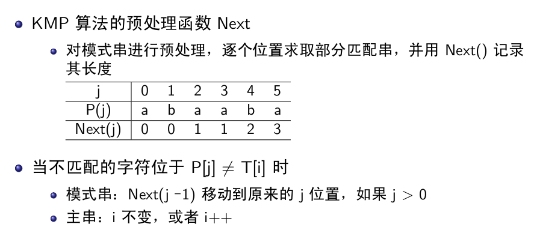
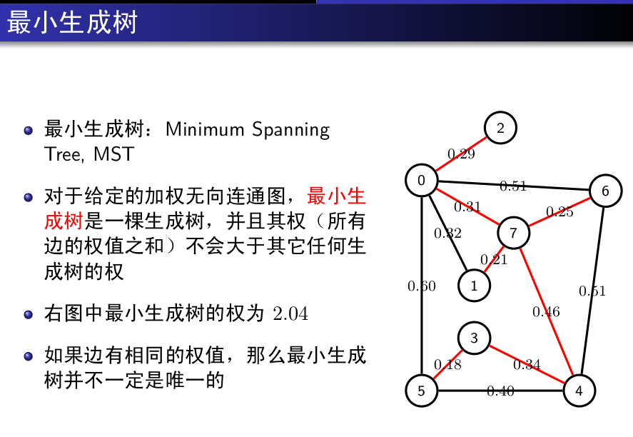

## 数据结构与算法(一)
## 王道烩
## 2018.9.7

算法的五个特征:

- 有穷性
- 确定性
- 可行性
- 输入
- 输出

### 基本数据结构

### 二元关系和抽象数据类型

程序=数据结构+算法

数据结构:数据的逻辑结构和存储结构,决定于问题的数学模型 .
算法:问题的处理策略,决定于数学模型的求解方法.
程序:指令集

数据的存储结构既要体现逻辑结构也要服从算法要求.

二元关系表示了集合M和N中元素之间的某种关系.

数据在计算机中的存储方式有:

- 顺序存储
- 链式存储

#### 抽象数据类型

### 线性表

#### 顺序存储

线性表中插入一个元素,平均需要移动一半元素

衡量算法的四个标准:

- 正确性
- 可读性
- 健壮性
- 高效率

#### 链式存储

为了在插入和删除的时候不用考虑头结点的情况,可以增加一个表头.

为了能够实现访问前驱,可以使用双向链表

#### 两种存储方式的优缺点

### 队列

队列是先进先出的数据结构.FIFO

队列的应用:

- 缓冲技术
- 排队系统

### 栈

#### 栈的应用

- 数制转换
- 括号匹配
- 表达式求值

### 串与串匹配

#### 串匹配算法

已知目标串和模式串,模式匹配就是在目标串中找到一个模式串P相等的子串.

##### 蛮力法

一步一步地移,直到末尾.

##### KMP算法

KMP算法自左向右匹配,当不匹配时,尽量向右移动最大距离.

KMP算法利用了模式串的性质,移动步数只与模式串P有关.
KMP算法的时间复杂度为O(m+n)

### 树

树表示以分支关系定义的层级结构.

树的性质:

- 树中节点数目等于所有节点的度数加1.

完全二叉树:深度为h,上面的层数都满了,最后一层从右向左连续缺若干节点.

要想实现二叉树的非递归算法,可以使用栈结构.如实现中序遍历.访问根节点,然后将根节点入栈,然后访问左孩子,有左孩子就一直入栈,然后没有的话就弹出这个节点,然后将这个节点的右孩子入栈.

先序遍历的非递归实现方式是:访问根节点,然后将右孩子入栈,然后访问左孩子.

后序遍历的非递归实现:要保证根结点在左孩子和右孩子访问之后才能访问，因此对于任一结点P，先将其入栈。如果P不存在左孩子和右孩子，则可以直接访问它；或者P存在左孩子或者右孩子，但是其左孩子和右孩子都已被访问过了，则同样可以直接访问该结点。若非上述两种情况，则将P的右孩子和左孩子依次入栈，这样就保证了每次取栈顶元素的时候，左孩子在右孩子前面被访问，左孩子和右孩子都在根结点前面被访问.

层序遍历可以使用队列的数据结构来实现.首先根节点入队,然后根节点出队并将其左右孩子分别入队,这样一直下去.

知道一棵二叉树的先序序列和中序序列可以将一个二叉树重建,同理后序序列和中序序列也可以将一个二叉树重建.但是先序序列和后序序列不可以.因为如果一个树只有左孩子后者只有右孩子,那么他们的先序和后序序列都是一样的,但是这两颗树却不一样.

#### 二叉搜索树

一棵树的左子树的节点都不自己小,右子树的节点都比自己大.
二叉搜索树的插入和查找操作类似,找不到就插入这个位置就行.

#### 二叉搜索树的旋转

旋转为了使树更加平衡.

- 定长编码:所有的码子长度相同.
- 变长编码:出现概率大的短码子,出现概率小的长码子.

- 前缀码:每个二进制串表示的字符都不是其他字符的前缀,为解码带来方便.

### 图

如果其中的边有序,则为有序图.如果无序,则为无序图.

欧拉路径:遍历图中每条边且只访问一回的路径.

#### 图的表示

对于稠密图使用邻接矩阵表示,稀疏图使用邻接表来表示.

#### 图的遍历

从已给的联通图中某一顶点出发,沿着一些边访问图中所有顶点,且使每个顶点仅访问一次,叫做图的遍历.为了避免重复,可设置一个标志顶点是否被访问的辅助数组.

##### 深度优先遍历

##### 广度优先遍历

广度优先遍历是分层搜索过程,不能够递归实现.

#### 最小生成树

时间复杂度是排序的复杂度.

#### 最短路径

