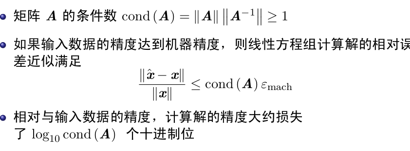
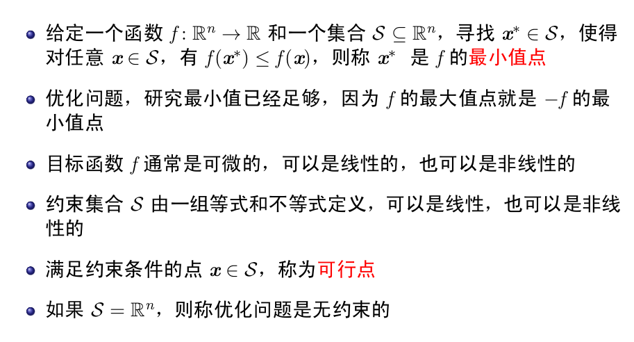
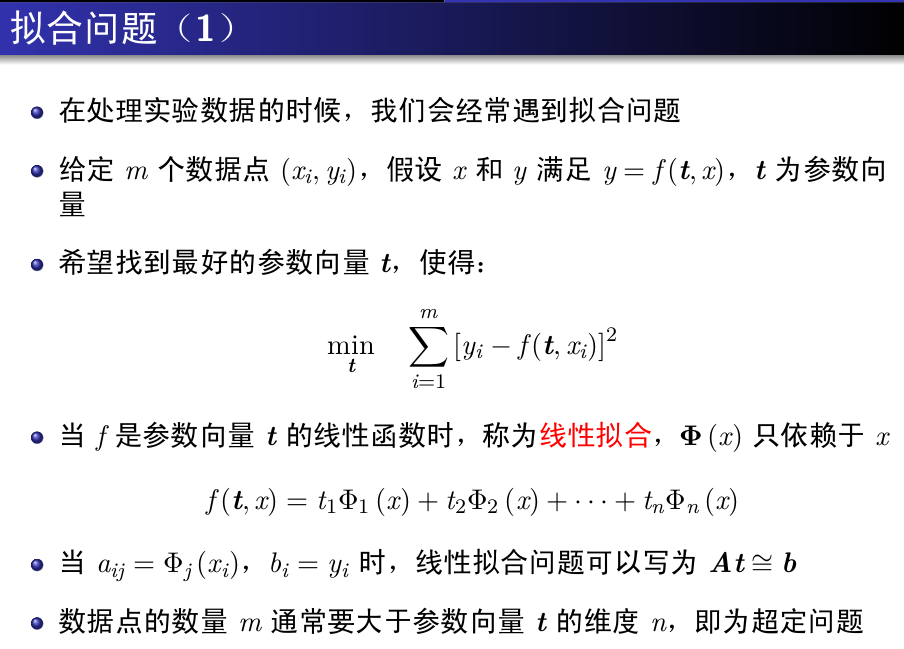
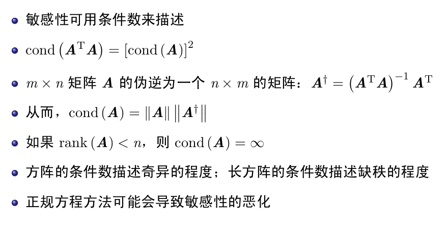

## 数据结构与算法(三)
## 王道烩
## 2018.9.8

### 数值问题

设计和分析数值型的算法,用于解决科学和工程领域的数学问题.\

- 线性方程组
- 非线性方程组
- 最优化问题
- 插值与拟合

一个问题是适定的,则满足:

- 解存在
- 解唯一
- 连续地依赖问题数据

不满足的为不适定的,问题数据的微小变化,会引起解的急剧的不连续的变化.

适定的问题解可能对于输入数据也很敏感.这样的问题为病态的,虽然连续依赖,但是斜率很大.

由于各种误差,如数学模型的误差,输入数据的误差,算法实现上的误差,所以数值分析一般满足于得到具有一定精度的近似解即可.

### 误差分析

数据误差来源于两项,一项是算法带来的误差,一项是数据带来的误差.

#### 前向误差和后向误差

如果一个算法对于计算中的微小扰动不敏感,则为稳定的.
算法的稳定性和问题的病态有相似之处,但是算法的稳定性是针对计算过程中差生的误差,问题的病态性是针对输入数据的微小扰动.

只有良态问题采用稳定的算法才能得到精确解.

### 计算机运算

** 浮点数系统中能表示的浮点数是不均匀分布的.**

浮点数的运算:

- 大数吃小数
- 两个相近的数相减会造成有效数字的损失\

### 线性方程组

#### 线性方程组的特性

#### 解法

- 高斯消元法,时间复杂度是O(n三方).为了稳定性可以选择列主元
- LU分解.将矩阵分解为下三角阵和上三角阵,复杂度也是O(n三方)

### 非线性方程的解

#### 解法

- 二分法

- 不动点法

- 牛顿法

牛顿法至少是超线性收敛的..如果是多重根,则退化为线性.

- 割线法

### 最优化初步

#### 一维优化

#### 多维优化

最速下降法

### 拟合问题

### 插值问题

