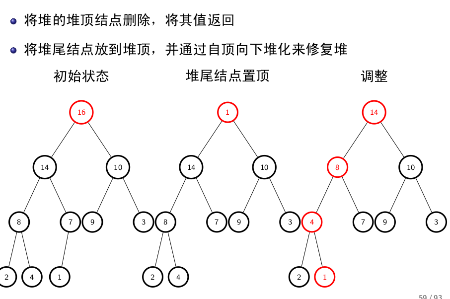

## 数据结构与算法(四)
## 王道烩
## 2018.9.8

### 蛮力法

暴力求解问题

### 分治法

把问题分解成属于同一问题的若干个较小规模的实例.

### 减治法

### 变治法

### 搜索算法

组合优化问题的常用解法:

- 回溯法
- 分之界限法

### 贪心算法

### 动态规划

### 随机算法

#### Monte Carlo 算法

### 算法优化问题

- 输入增强技术

KMP算法
B-M算法
计数排序

- 预构造

二叉搜索树
倒排索引

倒排文件是一种多关键字索引文件结构,适用于多关键字查询,倒排文件是搜索引擎的基本技术.

并查集

堆和堆排序

插入节点直接将节点加入到堆尾,然后调用自底向上堆化算法调整堆.这种方法叫做自顶向下的堆构造.时间复杂度小于NlogN.

#### 堆的删除

将堆顶点删除,然后将其返回,将堆尾节点放到堆顶,并通过自顶向下堆化来修复堆.

## 时空平衡

## 算法组合

