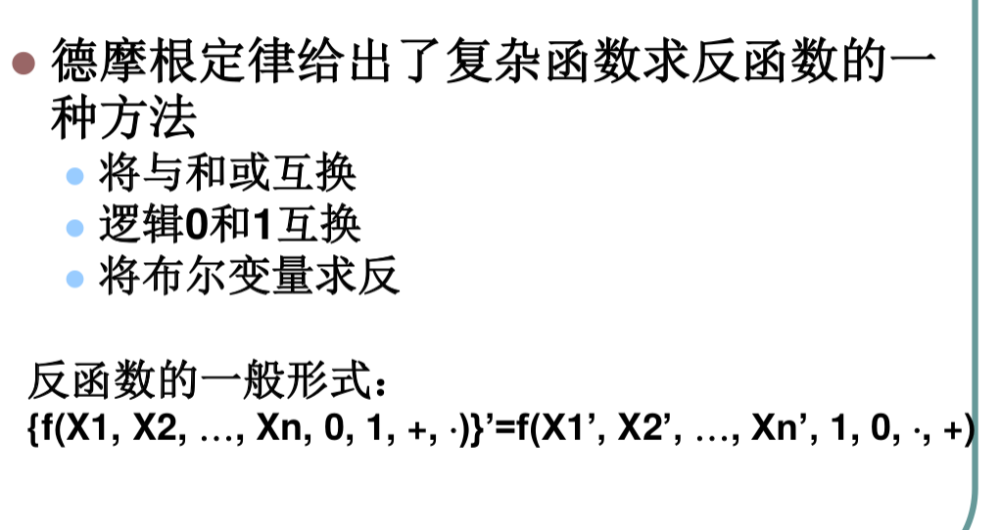
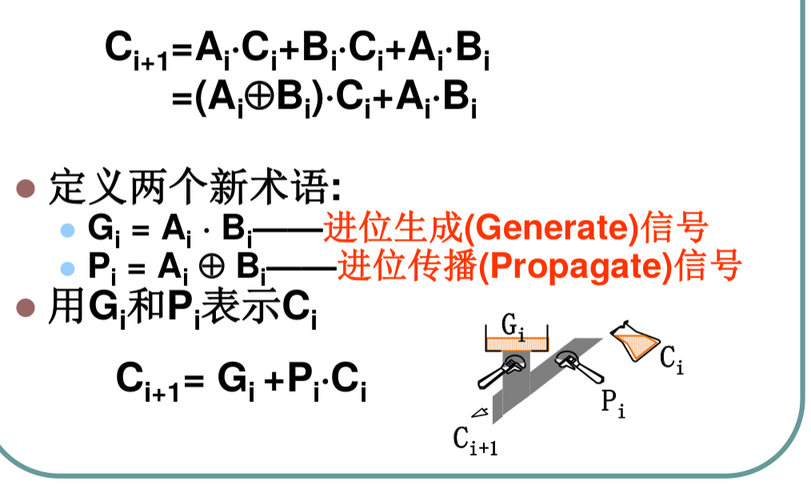
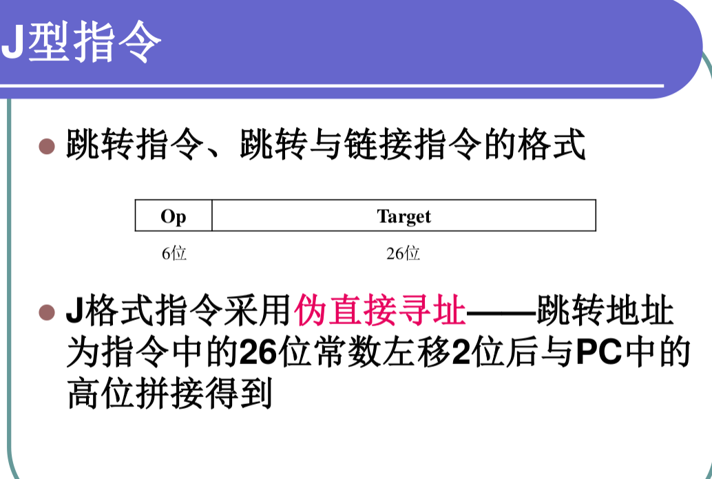
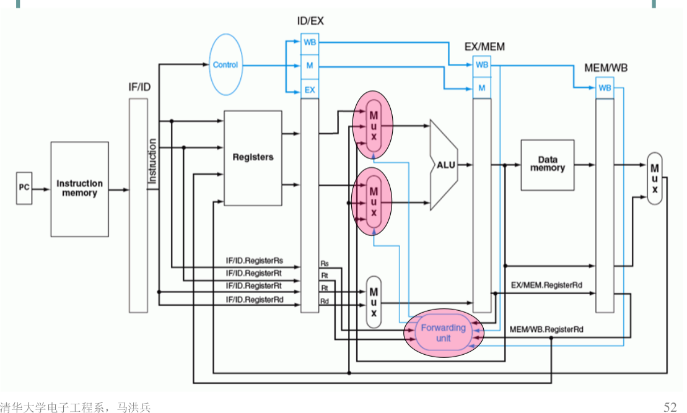
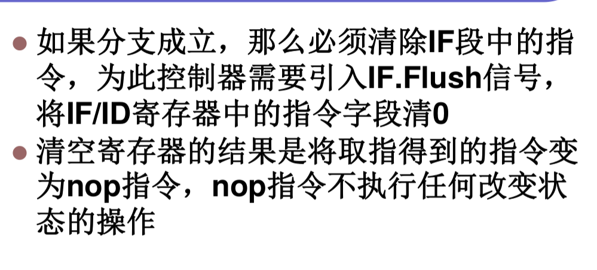

## 数字逻辑与处理器
## 王道烩
## 2018.9.4

### 绪论

将算法写成软件，然后利用基本的操作实现算法，然后用硬件实现这些基本的操作。
将函数计算看做过程，将其分解成多个基本步骤，每个步骤都是有限操作集中的一种操作，从而可以硬件实现。过程控制可以采用计数器，具有顺序执行和跳转的能力。通过存储单元记录过程中的状态。

#### 指令集体系结构(ISA)

ISA是硬件和软件之间的结构，它是程序员为使用一个二进制及其语言程序正确运行所需要了解的属性。

#### 基本原理

- 摩尔定律
- 计算复杂性理论
- 算法复杂性理论
- 能耗速度理论

### 数的表示与布尔代数

#### 不同进制之间的转换

十进制变成二进制：除二取余，乘二取整。转成其他进制可以先转成二进制然后在转。

原码：转化为二进制，最高位为符号位，0为正，一为负。
反码：正数反码不变，负数反码除符号位之外取反。
补码：正数补码不变，负数补码为反码加1.

溢出：运算结果超过计数系统所能表示的范围。

- 符号相同的两个数相加，结果的符号位与之相反。
- 符号位相异的两个数相减，结果的符号位与减数相同。

进位：加法过程中，最高位向更高位产生进位。减法过程中，最高位向更高位产生借位。

有符号树运算，出现溢出表示结果是错的。
无符号树运算，出现进位表示结果是错的。

**格雷码**
两个码子之间只差一位。

#### 布尔代数

与门可以通过使用输入取反的或非门实现。非门也能够使用相同输入的或非门实现，所以一个电路能够使用或非门实现所有功能。使用与非门也可以。但是异或门是不行的。

### 组合逻辑分析与设计

最小项的编号是使输出为1的变量值。最大项的编号是使输出为零的变量值。

最小项某些编号的和与最大项相反编号的积是等价的。(可以从逻辑上想)

开状态集合：使函数为1的所有输入组合
关状态集合：使函数为0的所有输入组合

化简方法：

- 卡诺图法
- QM算法：先合并，然后找到本质本原蕴含项，然后利用其他本原蕴含项得到最小覆盖。

本原蕴含项：无法与另外一个蕴含项相结合的项
本质本原蕴含项：某个元素仅由一个本原蕴含项覆盖。其是最简表达式的一部分

无关项：不完全确定的函数。

#### 组合逻辑

组合逻辑指输出是输入的函数，当前输入变量决定当前的输出，无记忆元件。
分析方法：找到布尔表达式，画出真值表，确定功能。
设计方法：逻辑抽象，列出真值表，逻辑化简，确定逻辑电路结构，映射成基础器件。

#### 多路选择器

可以使用多路选择器实现逻辑函数.

关键路经延时：从输入变化到输出的最长路劲的延时。

#### 超前进位：

#### 组合电路中的冒险

静态冒险：本来保持输出不变的输出经历瞬时转换

- 静态1冒险：取值为1的输出瞬时经历0状态
- 静态0冒险：取值为0的输出瞬时经历1状态

动态冒险：单次跳边但是发生了多次跳变。

消除静态冒险：

- 输出初始值和最终值能够被同一个本原蕴含项覆盖，则不会出现毛刺。
- 在输出端加一个寄存器，并使用采样脉冲来消除毛刺。

### 时序逻辑设计

时序逻辑电路任何一个时刻的输出状态不仅取决于当前的输入信号，而且与电路原来的状态有关，所以时序电路需要具有记忆功能的存储器件。

同步是所有元件能够在同一时刻改变装填，不使用同一个时钟的电路是异步的。产生时钟信号可以使用环形振荡器。

在时钟上升沿对正在变化的信号进行采样的话，输出是亚稳态。可能为0也可能为1.

#### 有限状态机

有限状态机可以分为两类：米利机和摩尔机。
米利机的输出依赖于输入和状态，摩尔机的输出只依赖于状态。所以一般摩尔机的状态比较多。

#### 锁存器与寄存器

锁存器在某些时候能够锁存信号，输出信号保持不变，但是还可以在某些时候透明传输。寄存器仅在时钟信号有效时采样输入，并改变输出状态。

D锁存器的建立时间与保持时间：
建立时间是在锁存操作开始之前，输入信号应该保持不变的最短时间。
保持时间是锁存操作之后，输入信号还应该保持不变的最短时间。

 时序电路分为同步时序电路和异步时序电路。
 同步时序电路是电路中所有的触发器使用同一个时钟，需要改变状态的触发器都在同一个时刻改变其状态。
 异步时序电路是电路中的触发器不一定是同一个时钟，需要改变状态的触发器只要满足条件就能够改变状态。
 
 
 
 激励方程：触发器输入端的方程，也称作驱动方程。
 特性方程：触发器的输出和输入以及状态之间的关系。
 次态方程：触发器下一个状态将是什么，依赖于触发器的激励方程以及特性方程。
 输出方程：输出和状态以及输入的关系。
 
 
 
 
 
 
 
#### 同步时序电路的设计

状态化简的方法:行匹配技术.蕴含表技术.
行匹配技术:如果次态和输出相同,则用新的状态代替这两个状态.

蕴含表能够找到等价状态对:

状态分配方法:

- 顺序编码
- 基于次态和输入输出的准则
- 单点编码(独热编码)

优先级:

- 最高优先级:具有相同次态的状态应该有相邻的编码
- 中间优先级:同一状态的次态应该有相同的状态编码
- 最低优先级:相同输入的状态有相邻的编码

这些优先级本质上希望使的最后的卡诺图化简尽量靠的近,这样能够使表达式简单.

#### 典型的时序电路

通用移位寄存器:

计数器:

- 加法计数器
- 减法计数器
- 环形计数器
- 扭环形计数器

计数器的设计主要是看能够自启动,如果不能自启动的话,可以增加外围电路,然后使得没有使用的状态的次态是使用的状态或者能够进入工作环的状态.

异步计数器

同步计数器:

### 计算机指令系统

指令集是所有指令的集合,是有限集合.

汇编器:将汇编语言转换成机器语言
编译器:将高级语言转换为二进制指令序列.

高级语言的执行途径;

- 编译:将这个源代码转换为二进制机器码,使用编译器.
- 解释:一条一条语句的执行.使用解释器.

#### 计算机性能评价

- 响应时间:提交作业到完成的时间
- 吞吐量:一定时间内完成的作业数.

#### MIPS

load指令和store指令使用的基址+偏移量的内寻寻址方式.

- 符号扩展:填充符号位(有符号数)
- 零拓展:填充零(无符号数)

习惯上栈按照从高到底的地址顺序增长.

#### MIPS指令格式

- R型(寄存器格式)
- I型((立即数格式)
- J型(跳转格式)

#### MIPS寻址方式

- 寄存器寻址:操作数在寄存器中
- 立即数寻址:以常数为操作数
- 基址加偏移量寻址:lw和sw的方式.一个寄存器存一个地址,然后16位有符号数作为偏移量.
- PC相对寻址:用于分支指令.当前指令的PC值加4然后加上16位有符号常数作为偏移.
- 伪直接寻址:J行指令.PC当前值的高四位与26位地址左移两位拼成.

### 处理器

#### 异常与中断

异常:来自处理器内部的不可预知的时间,例如算术溢出
中断:来自处理器外部的不可知的时间,如I/O.

获取异常处理程序入口地址的方法:

- 向量方式
- 原因寄存器

### 流水线

- 流水线:把一条指令的执行过程分解为若干个子过程,每个子过程与其他子过程同时进行.
- 超标量:同一时钟周期内执行多条指令.
- 超长指令字:一条指令中设置多个独立的字段,每个字段可以分别独立控制各个功能不见并行工作.

#### 冒险

- 结构冒险
- 数据冒险
- 控制冒险

结构冒险也是资源冒险,存在资源的不足,解决方法是增加资源.
数据冒险:一个操作必须等待另一个操作完成之后才能进行时.由指令之间的数据相关关系所导致.
控制冒险:处理器需要根据一条指令的结果做出决策时会出现控制冒险.

发生数据冒险的时候可以进行插入气泡来得到正确的结果,但是这样会浪费时钟周期,可以采用提前转发的方式来解决.

####  Load-Use冒险

由于load在WB阶端才能够得到值,但是这时下一条指令已经进入了MEM阶段,所以只是通过转发不够,必须将后一条指令阻塞一下.

实现阻塞的方法是先将需要阻塞的指令以及后面的指令的寄存器的写信号置为零,然后将后面的的寄存器的控制信号全部置为0,这样中间的指令相当于什么都没做.

#### 控制冒险

在设计的流水线MIPS处理器中,必须等到MEM阶段才能够确定是否进行分支.为了确保速度,可以引入提前分支.

### 存储器的层次结构

直接映射,一块只能映射到一个地方
全相联:一块可以映射到所有地方
组相联:一块可以映射到一组的几块上.

#### 替换策略

先进先出,最近最少使用

#### 写策略

- 通写:cache和主存都写
- 带缓冲的通写:写cache和缓冲区.
- 回写:只写cache,需要替换掉的时候写回主存
- 写无效:直接写主存,并令cache无效.

#### 分配策略

- 写分配: 先将数据装入cache中,然后在写,一般与回写一起使用.
- 写不分陪:只写主存,不装cache,与通写一起使用.

### 虚拟存储器

