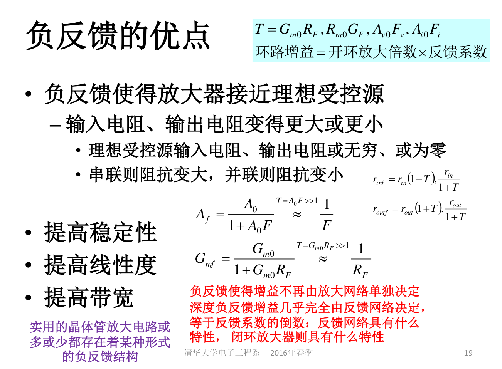
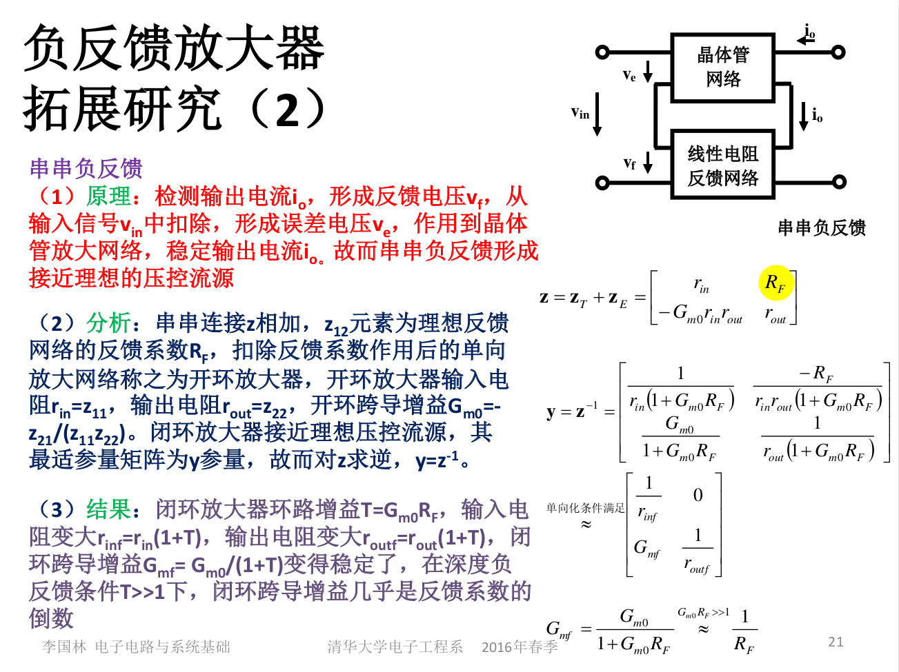
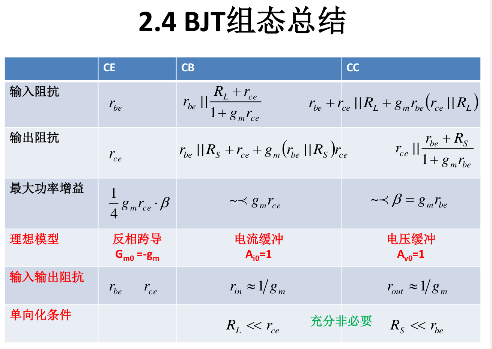

## 电子电路与系统基础(一) 
## 王道烩  2018.8.26

### 第一章 概论

信息：信息就是信息，即非物质亦非能量。人对什么有反应，人因之二做出某种决策行为，什么就是信息。

采集信息，处理信息，发布信息。

为什么用电路来处理信息：电便于传输，电便于处理。

电磁场和构成电路原件的导体，相互作用，能量交换，形成电路器件的电特性。

- 线性电阻：线性比值关系
- 线性电感、电容：线性微积分关系
- 非线性电阻：平方指数关系等

电路中电场用电压描述，磁场用电流描述。

信号负荷在电信号上，或者信息以电信号的变化形式存在，那么这种信息叫做电子信息。

**信号通过系统作用后的变化反映了系统功能。**

电磁波是信息传递的媒体。

电磁波传导的两种模式：辐射模式(无线通信)和传导模式(有线通信)。天线实现两种模式的转换。

为了实现有效的转换，天线的尺寸必须和波长可以比拟，一般一四分之一波长作为天线尺寸的度量。

调制：把基带信号调制到高频载波上。高频载波一般是正弦波，有三个参数，幅度，相位和频率。调频，调相，调幅。调制是为了实现有效的发射和接受。

滤波器用来进行选频，选择需要的信号令其通过。

电磁波以球面波传递，能量密度与距离平方成反比。

电能转换：

- 交流转直流：整流器。
- 直流转直流：稳压器。
- 直流转交流：逆变器。
- 交流转交流：变压器。

电路的基本素养：

- 电路基本定律和基本分析方法的掌握
- 电路抽象思维方法和工程近似手段的掌握
- 基本器件及基本单元电路的基本结构，基本原理，基本特性
- 基本概念的建立

### 第二章电源和电阻

- 直流：电流方向始终朝一个方向，且电流值恒定。
- 交流：电流大小和方向随时间有变化，且电流的平均值为零，则为交流。

电源的额电动势是电源的开路电压。

- 电阻抽象：自由电子移动碰撞原子晶格，能量转化为热能。
- 电感抽象：导线电流会在导线周围激发磁场，电能转换为磁能。
- 电容抽象：导体被截断，子哟电子在导体结点上积累，电能以电荷积累效应存储在导体结构上。

系统分类：

无记忆系统：系统输出仅由当前输入决定。线性电阻
记忆系统：系统输出不仅由当前输入决定，还与之前的输入有关。线性电容
线性系统：满足叠加性与均匀性。
非线性系统：不满足。
时变时不变：系统参量是否随时间变化。

端口：**一个端点流入的电流和另外一个端点流出的电流相同，这两个端点构成一个端口**。

定义端口之后，只关心端特性，内部如何工作可以不关心。

从端口对网络进行描述：

外界只能够看到端口，网络的特性可以从端口的电压电流关系来定义。
每个端口有一对变量(vj,ij)。
n端口网络需要n个方程才可以完备描述其电特性。

电源等效：

- 戴维南等效：流控形式的等效电路。
- 诺顿等效：压控形式的等效电路。

两者在外端口的伏安特性来看完全相同，内阻很小时，电源更接近理想电压源，使用戴维南等效。内阻很大时，更接近理想电流源，使用诺顿等效。

电源内阻反应了电源能力的大小，电源能够输出的最大功率为额定功率。负载电阻和电源内阻相等时，负载能够获得电源输出的最大的功率，这称为**最大功率传输匹配**.源的能力由源幅度和内阻共同决定。

晶体管

### 第三章 电路基本定律和基本定理

基尔霍夫定率：

基尔霍夫电压定律：两个节点之间的电压和路径无关。
基尔霍夫电流定律：流入一个节点的电流等于流出这个节点的电流。

基尔霍夫定律描述的是元件、网络端口之间的链接关系。
元件约束条件，网络端口方程描述的是元件，网络自身的电特性。
这两者结合起来能够完备描述整个电路网络的特性。

支路电压电流发法(2b)法：

电路网络有b条支路，n个节点。
以b条支路的支路电压和支路电流为待解未知量，共2b个待求量。
2b个方程：

- b条支路(端口)，每个支路有一个元件约束方程。
- n-1个独立的KCL方程。
- b-n+1个独立的KVL方程。

#### 降低方程规模的方法

支路电流法：b个支路电流为未知量列些方程，n-1个KCL，b-n-1个KVL，将支路元件约束带入KVL，使得方程中只有b个支路电流未知。

回路电路法：以回路电流为未知量，回路电流蕴含KCL。列些b-n-1个KVL，代入元件约束。

节点电压法：设定其中一个结点为参考地节点，n-1个节点电压为未知量，列些n-1个方程。然后n-1个KCL方程，KVL蕴含其中，元件约束代入。

#### 替代定理

一个电路网络可以分割为两个单端口网络的对接关系，假设该端口的电压为Vp,端口电流为Ip,则可以使用理想电压源或理想电流源替代任意一个单端口网络。而另一个单端口网络的内部的电压和电流均维持不变。

#### 叠加定理

叠加定理只适用于线性电路。线性电路中，所有独立源同时激励时所产生的总响应，等于非独立源单独激励时所产生的分响应的代数和。

### 等效电路法

电源化简：理想恒流源可以具有任意电压。理想恒压源可以具有任意电流。

#### 戴维南-诺顿定理

#### 受控源

描述了电路中不同端口之间的相互作用，引入了受控源，简化电路分析，规范电路分析方法。

####  含线性受控源的戴维南-诺顿定理

线性受控源仅仅用于描述端口之间的线性关系作用，在求戴维南内阻的时候，独立源的作用为0，但受控源代表的端口之间的作用关系并不会消失，所以必须保留受控源的作用。

#### 二端口网络

其余的可以类推。

网路一共有六种表达方式。阻抗、导纳、混合、逆混合、传输、逆传输。

其中传输参量以一共端口的电压电流为变量，表示另外一个端口的电压和电流。但电流是负的。可以和后面的端口对接。

双向网络的输入输出阻抗和网络外负载有关。单项网络的输入输出阻抗是网络的自身属性，和外界负载无关。

#### 线性阻性网络的典型应用

阻性网络：网络端口电压和端口电流之间的关系用代数方程可以完全描述。
动态网络：网络端口之间的关系需要微分方程才可完全描述。
线性网络：端口电压电流之间的关系方程为线性方程。
非线性网络：端口电压电流之间的关系不能用线性方程描述。
互易网络：激励和响应可以互换的二端口网络为互易网络。不能互换的为非互易网络。
由线性电阻，线性电容，线性电感、传输线等互易元件组成的网络是互易网络。

有源网络：具有向端口外提供电功率的网络
无源网络：不具有向端口外提供电功率的网络

耦合：两个端口之间存在相互作用关系。

- 本证增益：输出端口开路电压短路电流和输入端口电压电流的线性传递系数。和负载无关的增益。
- 传递函数：考虑负载的影响，为负载的函数，一般为电压传递函数。

功率增益的三种定义：

多端口的特征阻抗：当其他端口接各自的特征阻抗时，从第i个端口看入的特征阻抗为Zoi.

##### DAC/ADC核心部件

DAC为开关，依据数字量的要求拨向相对应的位置，输出该位置提供的模拟电压，即可完成DA转换。

ADC为比较器，一句模拟量所处区间，输出相应的数字量即可完成AD转换。

##### 放大器

任何一种放大器都可以采用四种不同的表现形式，但是有一种是最适参量举证：这和哪一种更接近理想受控源有关，同时也和负载有关。

放大器的功用：信号放大，信号缓冲(利用基本放大器的单向特性，隔离源和负载)，信号线性转换(使用接近理想的压控流源或者流控压源能够将电压源转换为电流源或者电流源转换为电压源)。

理想变压器能够实现阻抗变换或者源的变换。也能够实现单双端的转换。

单端信号：端口的一个端点接地。
双端信号：端口的两个端点对地的电压相位相反。
悬浮：两端相对电压确定，单绝对电位非自身所能确定，可由外电路确定。

### 非线性电路

非线性电路没有成熟的统一的方法，一般是具体问题具体分析。

基本方法：

- 解析法 ：差分对管
- 数值法：牛顿法
- 局部线性化：交流信号足够小，确定直流工作点，直流工作点上进行交流分析
- 分端线性化
- 准线性化

微分电阻：切线的斜率对应的就是微分元件参量，微分电阻，交流电阻，动态电阻。

#### 桥式整流

#### 电流镜电路，反向器电路

MOSFET管的特性

MOSFET的三个取有明确的物理意义：

- 截止区：电流为零，开路
- 欧姆区：抛物方程，线性化为线性电阻
- 恒流区：几乎平直，线性化为诺顿源

电流镜电路相当于左边的MOS管当二极管使用然后给右边的做偏执，两个管子的栅极和源极电压相同，所以在饱和区的时候电流和工艺参数有关，能够将电流镜像过去。

#### NMOS反向器

#### BJT

### 交直流分析法

先直流分析，在电路总保留直流源的作用，获得直流工作点，然后采用交流小信号分析，所有元件都用微分线性元件代替，线性电阻还是线性电阻，电压源短路，电流源开路，非线性电阻用微分电阻替代，。

- 耦合电容：大电容，直流开路，交流短路。可抽象为微分内阻为0的恒压源，交流分析时视为短路。
- 高频厄流圈：大电感，直流短路，交流开路。可抽象为微分内导为0的恒流源，交流分析时视为开路。

由于存在耦合电容和高频厄流圈，所以直流分析和交流分析的两个电路的结构会不相同。

负阻能够将直流能量转换为交流能量。负阻的有源性来自于直流偏置电压源提供的直流能量。

#### 线性范围

只有在线性范围内采用小信号模型才是成立的。
总谐波失真是其他各次谐波分量的能量之和与基波能量的比值。
1dB线性范围：非理想微分在极值点附近划定1dB范围。

反射型负阻放大器：环型器，提供无功率反射的端口匹配条件。

#### BJT交直流分析电路模型

#### MOS交直流分析电路模型

### 晶体管放大器

高增益放大器的实现：

- 使用有源负载，由于扼立效应，存在这较大的微分电阻
- 使用缓冲器
- 使用级联加缓冲

##### 常用参数

### 双晶体管电路

对于输出电阻，一般对于MOS管或者BJT管，可以直接其中两个端口的电阻比容易记忆，一个是输入端的电阻，另一个是厄利电压产生的电阻。还有一个端口的电阻不容易求，可以在这个时候先看另外两个端口的电阻是多少，然后再用上面的结论，直接得出结果。

#### 电流镜

将晶体管偏置在有源区，集射CE(漏源DS)端口对外就是电流源。
集成电路中，电流源的两个作用：

- 为放大器提供直流偏置电路。
- 作为小信号放大器的有源负载。

 
 
 
 
 
 通过增加射集负反馈电阻，能够提高电流的稳定性。这样能够得到一支比较稳定的电流，然后可以使用电流镜电路，来得到很多想要的电流。
 

#### 差分对电路

差分对的共模输入范围要求是所有晶体管都能够工作在有源区。差模输入范围是其中某一个管子处在截止。

非线性转移特性曲线，将其泰勒展开，其一次项系数和三次向洗漱的比值一定程度上反映了线性度的大小。然后在一阶微分的1d范围内，可以视为线性跨导。

在对差分对进行小信号分析的时候，可以认为电流源的电压不变，为差分交流地。

在双晶体管电路中，一般是差分管电路，主要是看电压增益。看电压增益其实主要也是看输出电阻的大小。

由于如果是双端的话，虽然电阻是两边都算，但是由于一边只有一般的电流通过，所以增益和单端的一样。单端电流都从一边流过，输出电阻是双端的一半。

#### 一些电路

对于上面的电路，需要能够一眼看出输入电阻，输出电阻以及跨导增益。

由于跨导放大器一般都有比较高的输出电阻，可以提供很高的本征电压增益，但是无法驱动重负载。(小电阻，大电容)。所以需要级联电压缓冲器，缓冲器有较小的输出电阻，可向外提供大的电流，用于驱动重负载。

##### A类缓冲器

A类放大器最高理论效率是50%.

##### AB类放大器(推挽结构)

AB类的偏置电压使得双管微微导通，有静态功耗，但是不大。

B类放大器没有Vb偏置电压，没有静态功耗，但是有交越失真，线性度太糟糕。

B类效率最高，A类效率最低，AB类居中。

### 741内部电路

