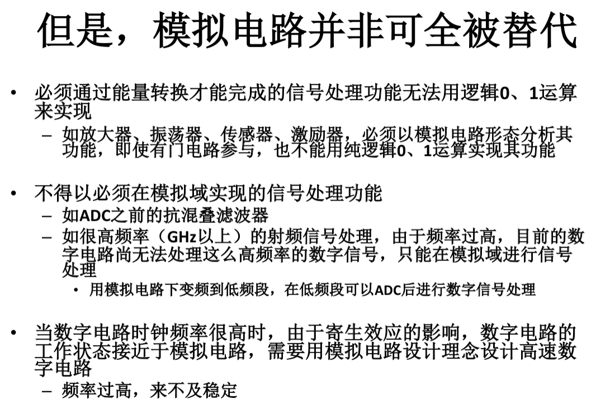
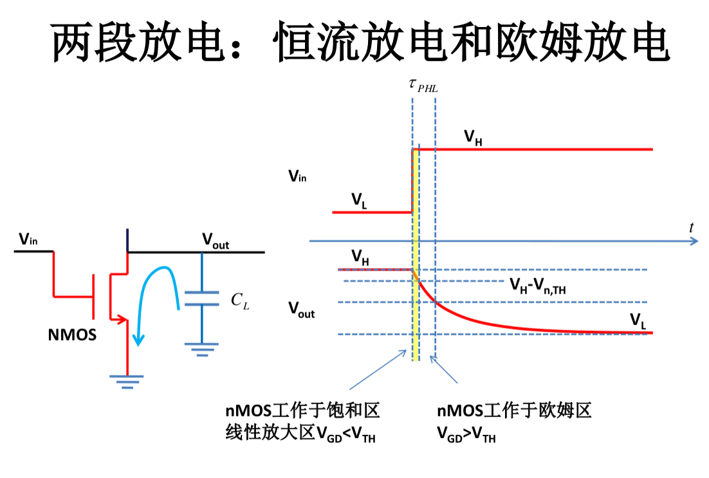
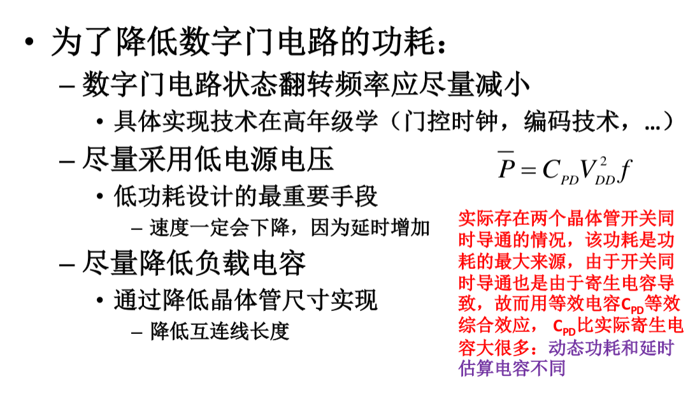
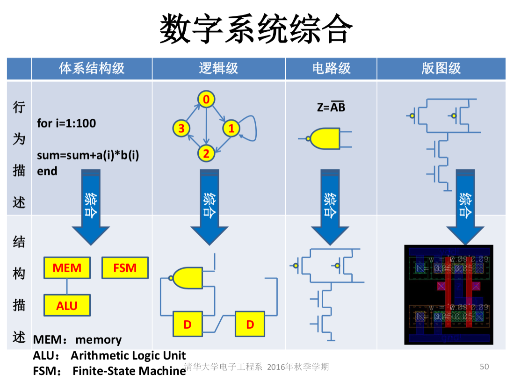
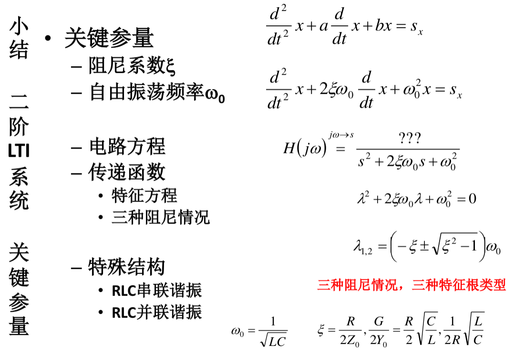
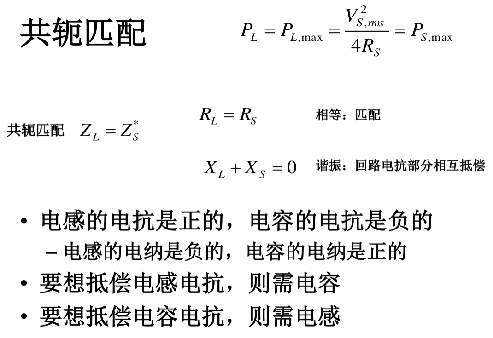
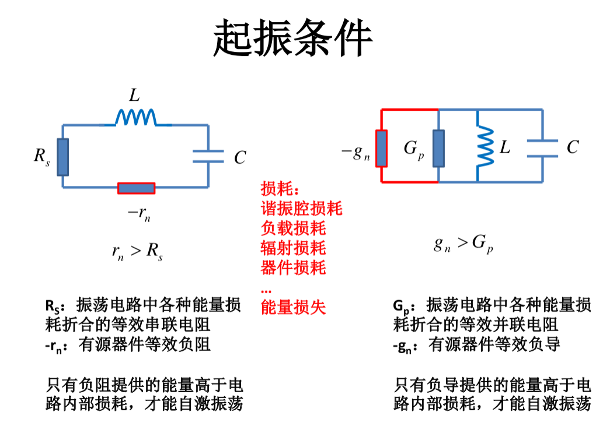
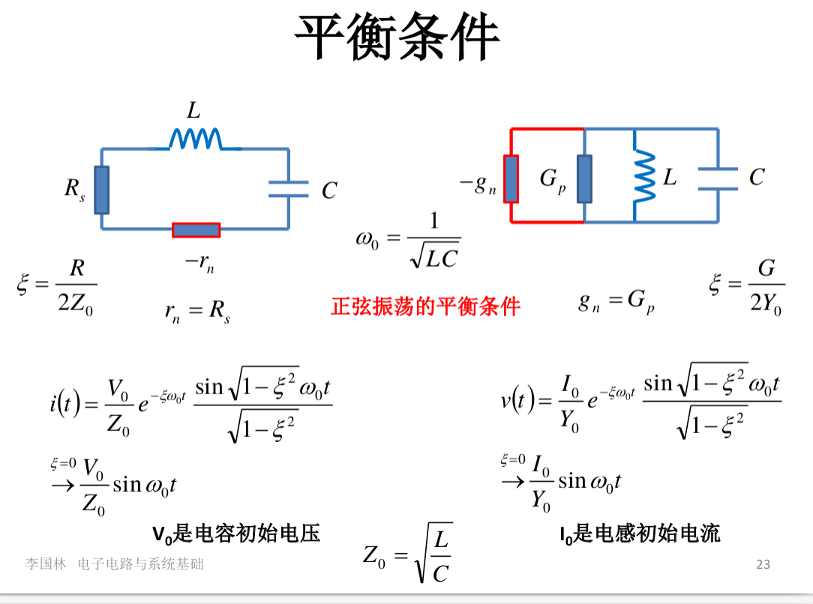

## 电子电路与系统基础(二)
## 王道烩  2018.8.27

### 运算放大器

OPA。通过适当地选取外围电路，可以用来构造各种运算单元。

分段模型：

#### 一般运放的参数

如果有负反馈，那么可以先假设运放工作在线性区。可以采用虚段虚断进行分析。

虚段是因为增益很高，但是输出电压有限，所以可以认为两个输入端电压相同。
虚断是因为输入阻抗非常大，这样可以认为没有电流流入。

#### 负反馈

对于负反馈分析，先假设输出电压有微小变化，然后通过外围电路，反应到两个输入端是怎么变化，然后判断是否是负反馈。

使用负反馈，由下面的计算可知，放大网络的放大系数完全由反馈网络的反馈系数所决定，和放大器无关，这为电路设计提供方便。

#### 四种类型的反馈

串联会使电阻变大，并联会使电阻变小。

对于不同类型的链接，都可以使得阻抗的变化与想要的类型更加地符合。如串串连接，检测输出流，形成反馈电压，使得输入阻抗变大，输出阻抗也变大。这样输入阻抗变大，分压就更多，输出阻抗变大，变成更加理想的电流源。

#### 运放失调

失调是指输入为零但书输出并不为零，可以增加调零端以及外部调零电路来强制输入为零时输出为零。

通过运放能够实现以下电路：

- 加法电路：通过不同支路将各路电流汇总，还可以加权。
- 电压跟随器：作为缓冲，隔离负载对信源的影响。
- 调制电路等。

#### 运放的非线性应用

在运放的一端输入参考电压，然后另一端输入待测电压，就能够实现比较器的功能。
为了应对噪声问题，可以使用施密特触发器，将输出端反馈同乡输入端。

### 晶体管数字门电路

先画出卡诺图，一般只使用3,4个变量，然后化简表达式，然后采用CMOS实现晶体管级电路。

各种门能够通过开关实现，与门通过开关串联，或门通过开关并联，非门通过旁路开关实现。通过组合能够实现与非与或非功能。

可以使用CMOS实现开关的功能，使用上P下N的结构，能够使得不管在任何一种输入装填，只有一边是导通的，另一端是悬浮的，这样就能够降低静态功耗，但是由于寄生电容的存在，所以还是存在这波动时候的电容的充放电，存在动态功耗。

一个变量需要两个晶体管，然后输出最终还需要一个非门两个晶体管，这样可以计算出最终需要的晶体管的数目。

#### 数字电路的优势

- 抗干扰能力强
- 功耗低
- 面积小
- 可大规模集成

### 电容与电感

电容与电感具有下面的特性：

- 记忆性
- 连续性
- 无损性

#### 互感变压器

同名端的判断：流入电流使得磁通加强的两个端点是同名端。

理想变压器是互感变压器在全耦合的情况下，切电感量极大的情况下的抽象。即不储能也不耗能。

 电容串联，电感并联与电阻并联相同。电容并联，电感串联，与电阻串联相同。

#### 动态系统数值解

分为前向欧拉法与后向欧拉法。将过程离散化，然后进行数值求解。

前向欧拉法使用当前时刻的状态变量的值来计算积分，后向欧拉法使用下一时刻的状态变量的值来计算积分。前向欧拉法不一定保证收敛，需要看时间间隔与时间常数的关系，但是后向欧拉法自包含收敛性。

### 向量法

#### 相图

以独立状态变量为坐标轴，然后画出系统的状态变量在坐标轴之间的移动轨迹叫做相图。

#### 向量法求正弦稳态响应

将三角正弦信号拓展为复信号，然后在电路稳定的状态下，利用电容电感的微分关系，得到电压向量和电流向量之间的关系，求导为乘以jw ，积分为除以jw。然后将元件换为对应的复信号下的元件即可。各种电路规律不变。

同时通过这种方法能够得到一种系统的传递函数，从而能够得到幅频响应和相频响应。下面是一种比较特殊的选频网络

#### 功率

- 瞬时功率：任一时刻的瞬间功率，为电流乘以电压
- 平均功率：一个周期内公功率的平均值
- 视在功率：电容和电压有效值的乘积，看上去消耗的功率。平均功率与视在功率的比值为功率因数。为功率因数角的余弦。
- 复功率：

### 一阶RC电路时域分析

三要素法：全响应=零输入响应+零状态响应   全响应=稳态响应+(初值-稳态初值)*衰减项

#### 一阶动态电路时频分析

##### 时域分析

 冲击信号的各个频率分量幅度相同，将冲击信号作用在系统上，检测输出信号，然后对输出信号做傅里叶变换，就能够得到各个频率信号对应的幅度相位变化，就能够得到系统的传递函数。
 
 存在冲击电流时，电容电压可能突变，存在冲击电压时，电感电流可能突变。
 
 
 
 但是一般分析的时候，冲击信号容易产生，所以使用冲击信号的积分，阶跃信号作用在系统上，然后对输出信号求导，就能欧得到冲击响应。
 
 
 
 积分效应对应输出相位滞后输入相位，积分表示除以jw，滞后。微分效应同理。
 
 
 
 
 
 
 
 
 
 
 
### 一阶非线性动态电路

上升沿时间与下降沿时间:幅度变化为10%-90%所占时间。

### 状态记忆单元

### 二阶动态电路

先列些方程得到二阶微分方程，然后得到初值和微分初值，就能够得到解析解。

### 二阶LTI动态电路时频分析

对于带通系统来说，带宽越窄，信号延时越大。

#### 谐振

对于二阶系统而言，若是串联，由于电容的滞后以及电感的超前，使得在某一个频点的时候，两个的大小相同，然后两者的电压相互抵消，这时两者上的电压可能大于电源电压，这就有了谐振。并联电流谐振同理。两者的电流等大反向，可以比电流源电流大。

### 阻抗变换网络

#### 最大功率传输匹配

### 正弦波振荡器

#### 准线新分析

准线新分析可以将非线性系统看做线性系统，由于频率选择性很高的选频电路的存在，使得只有基波分量被保留下来用于激励负阻器件，可以看做线性电路。

