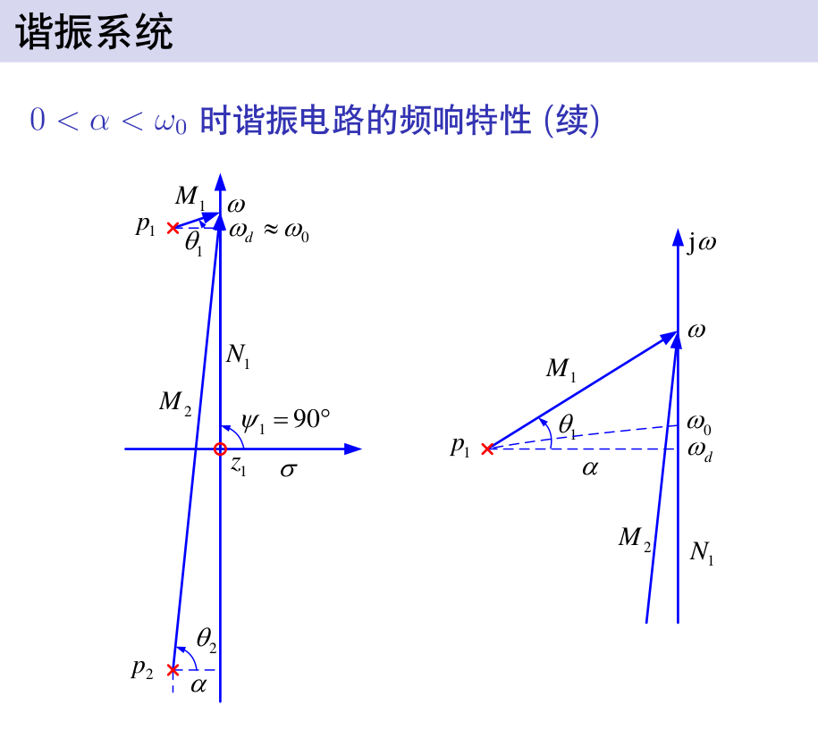
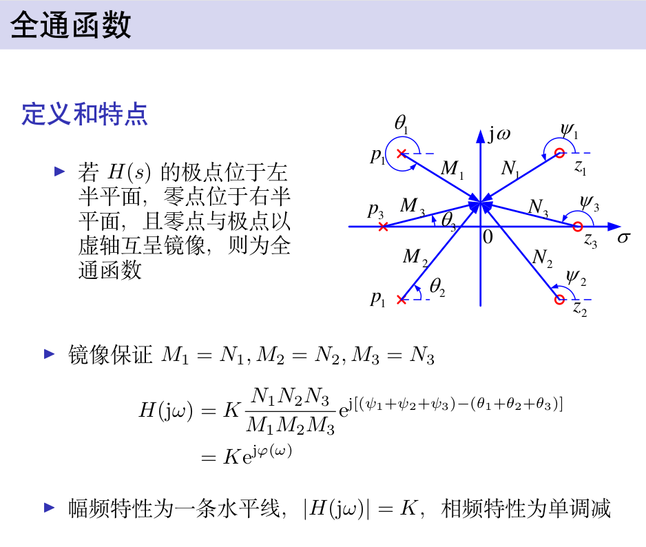
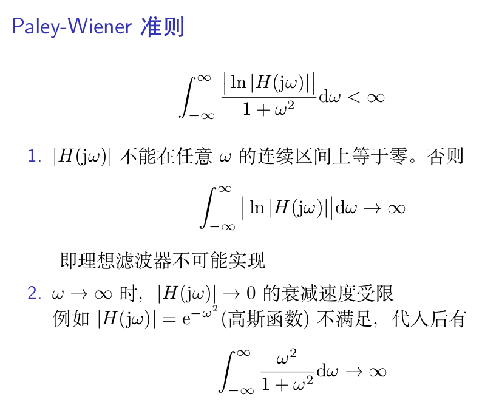

## 信号与系统
## 王道烩
## 2018.9.5

### 课程大概

信号与系统是关于信号和系统的基本概念和基本分析方法的课程.

#### 单位冲击信号

实际信号都是实信号,认为构成复信号后分析更加方便.

可逆系统:不同输入不同响应.

稳定系统:输入有界输出有界.(BIBO)

线性系统:满足叠加性与齐次性.

时不变系统:输入延时,输出波形不变,只是时间推迟.

线性时不变系统具有微分性和积分特性.可以由线性和时不变特性推出.

因果系统:某一个时刻的响应只与这一时刻之前的输入有关.

#### 系统的数学模型表示

然后根据初始条件确定待定的系数.

在判断初始状态是否发生跳变的时候,可以使用物理的方法,也可以使用数学的方法.数学的方法只要是delta函数匹配法.方程两端奇异函数平衡.

复指数函数是LTI系统的特征函数.

#### 卷积

将输入信号分解成一系列的冲击信号的叠加,然后由线性时不变性,可以将输出看做一系列输出的叠加.然后利用卷积进行加权叠加就可以得到任意输入的输出.

复指数函数是LTI系统的特征函数.输入是复指数函数,输出仍是相同指数的复指数函数.只是幅度和相位发生变化.

卷积的微积分性质

### 傅里叶变换

冲击函数的傅里叶变换是1.

时域压缩,频域扩展,时域扩展,频域压缩.
时域压缩,能量减小,各频率分量减小.

### 周期信号的傅里叶变换

### 抽样

### 拉普拉斯变换

### 传递函数分析

#### 全通函数与最小相移函数

全通函数不影响幅频响应,只影响相频响应.一般在系统中做相位矫正.

零点全部在左半平面或jw轴上的为最小相移系统.非最小相移系统可以表示为最小相移系统与全通函数的级联.

#### 双边拉普拉斯变换

### 傅里叶变换的应用

#### 无失真传输

线性失真:没有多出频率分量
非线性失真:有新的频率分量出现.

线性失真包括幅度失真和相位失真.

无失真值得是希望响应和激励形状相同,幅度可以改变,延时可增加.

吉布斯现象可以理解为用阶跃信号去和sa函数做卷积,卷到一半的时候,为0.5,但是在sa函数右半部分第一个零点之前,总会有一部分是大于零,积分就会出现过冲.

#### 系统的物理可实现性

paley-Wiener准则是判别可实现性的必要条件不是充分条件,只约束了幅度特性,没约束相位特性.实际上只有多项式类型的函数和双曲函数满足佩里-维纳准则.

##### 希尔伯特变换

由上述推导可知,因果是实信号的傅里叶变换的实部和虚部之间是存在制约关系的.

### 调制与解调

目的:

- 传输更远
- 天线尺寸
- 多路复用
- 零点漂移?

抑制载波调幅:和与余弦函数想乘.
调幅:

解调过程是包罗检测电路,可以通过二极管电容电阻来实现.

#### 单边带

可以节省带宽

  

解调频的时候,先对信号求导,然后用包络检测电路检测出包络,.或者直接使用建平器或者鉴相器直接提取出频率和相位的变化.

### 抽样信号回复原始信号

